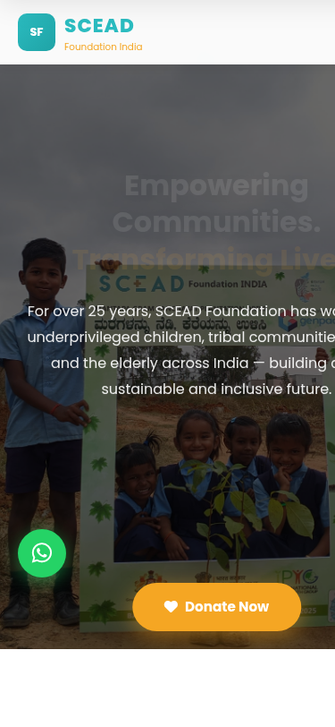

<div align="center">

# SCEAD Foundation India

### Space for Children in Education, Art and Development

[](https://www.sceadfoundation.org/)
[](https://wa.me/919845222812?text=Hello%20SCEAD%20Foundation!%20I%20visited%20your%20website%20and%20would%20love%20to%20know%20more%20about%20your%20work.)
[](#-donate)
[](#)

<br />


<br />

**Empowering Communities. Transforming Lives.**

*A Bengaluru-based non-profit dedicated to environmental sustainability, education, tribal welfare, women's empowerment, and community development since 1998.*

---

</div>

## About SCEAD Foundation

**SCEAD Foundation India** (Reg. No: GAN-04-00209) is a registered NGO founded in **1998** by **Siju Thomas Daniel**. For over two decades, we have driven sustainable initiatives spanning climate action, education, health, and rural development across India — impacting **500,000+ lives** in marginalized communities.

Our work is endorsed by the **Governor of Karnataka**, the **US Secretary of State**, former **UN Environment Executive Director Mr. Erik Solheim**, and diplomatic missions from **Italy, Japan, Germany, Canada, UK, Australia, and France**.

> *"We believe that true development starts at the grassroots — when you empower a child with education, a woman with livelihood, and a community with dignity, you change the world one village at a time."*
>
> — **Siju Thomas Daniel**, Managing Trustee & Founder

---

## Impact at a Glance

<div align="center">

| Metric | Impact |
|:---|:---|
| Lives Impacted | **500,000+** |
| Trees Planted & Lakes Restored | **200,000+** |
| Women Empowered | **300,000+** |
| Vulnerable Youth Aided | **50,000+** |
| Sanitation Units Built | **500+** |
| Government Schools Adopted | **35** |
| CSR Partners | **10+** |
| Years of Grassroots Work | **25+** |

</div>

---

## Website Screenshots

### Homepage — Hero Section


### About Us Page


### Programs Page


### CSR Partnership Page


### Mobile Responsive
<div align="center">

</div>

---

## Core Focus Areas

### 1. Climate Action & Environmental Sustainability
- Large-scale plantation drives across Bengaluru, Anekal, Jigani, Bannerghatta, Shillong, and Metur Dam
- Lake rejuvenation and ecosystem restoration
- Carbon sequestration verified by **CERA** (Carbon Emissions Reduction Assessment), Mumbai
- "Sowing Seeds of Sustainability" — 7,000 saplings project with Genpact (2024-2025)
- Government Partnership: Governor of Karnataka flagged off Million Trees Project

### 2. Education & Child Welfare
- Education support for government school children from disadvantaged backgrounds
- 35 government schools adopted for comprehensive support
- Anti-child labour awareness campaigns
- Blood group identification and health screening programs
- HIV orphanage (Home for HIV) and Girl Child orphanage programs

### 3. Tribal Welfare & Community Development
- Livestock distribution (cows, calves, sheep, goats) to 15,000+ tribal beneficiaries
- 500+ sanitation units built for tribal communities and slum dwellers
- Adopted 3 tribal villages in Bandipur for comprehensive development
- Disaster & crisis management (Turkey Earthquake Relief 2023, COVID-19 Relief 2020)

### 4. Women Empowerment
- Skill development and tailoring training for 300,000+ women
- Saukhyam reusable sanitary pad production training for tribal women in Bandipur
- Financial independence through livelihood initiatives

---

## CSR Compliance

SCEAD Foundation is fully equipped for corporate CSR partnerships:

| Document | Status |
|:---|:---|
| 80G Registration | AAITS0428E25BL02 |
| 12A Registration | AAITS0428E25BL01 / AAITS0428E |
| CSR-1 Registration | Verified |
| Certified Audit Reports | 3 years available |
| Income Tax Returns | 10+ years continuous filing |
| Government Registration | GAN-04-00209 |

---

## Tech Stack

This is a **static website** built for performance and simplicity:

- **HTML5** — Semantic, accessible markup
- **CSS3** — Custom responsive design system with CSS variables
- **Vanilla JavaScript** — Scroll animations, animated counters, mobile navigation
- **Google Fonts** — Poppins typeface
- **Font Awesome 6** — Icon library
- **Zero frameworks** — No React, Vue, or build tools needed

### Performance
- Lazy-loaded images
- Lightweight footprint (~25KB CSS + ~6KB JS)
- Intersection Observer for scroll animations
- Mobile-first responsive design (375px to 1440px+)

---

## Project Structure

```
sceadfoundation/
├── index.html              # Homepage
├── about.html              # About Us — timeline, founder, values
├── programs.html           # Programs — environment, education, community
├── csr.html                # CSR Partnership — compliance, partners, form
├── volunteer.html          # Volunteer & Intern — opportunities, form
├── contact.html            # Contact — form, map, office info
├── styles.css              # Global responsive stylesheet
├── scripts.js              # Animations, counters, navigation
├── images/                 # SCEAD Foundation project photographs
│   ├── children-plantation-banner.jpg
│   ├── plantation-drive.jpg
│   ├── child-learning.jpg
│   ├── livestock-distribution-women.jpg
│   ├── livestock-event-group.jpg
│   ├── cow-distribution-tribal.jpg
│   ├── community-gathering.jpg
│   ├── elderly-care.jpg
│   ├── volunteer-children.jpg
│   ├── saukhyam-pads.avif
│   └── child-labor-brickkilns.webp
└── screenshots/            # Website screenshots for README
```

---

## Run Locally

```bash
# Clone the repository
git clone https://github.com/vmishra/sceadfoundation.git
cd sceadfoundation

# Start a local server
python3 -m http.server 8888

# Open in browser
open http://localhost:8888
```

No build step, no dependencies, no configuration. Just open and go.

---

## Our Partners

<div align="center">

**Genpact** · **Ascend Telecom** · **Anthem Biosciences** · **Zentree Labs** · **IDA Interior Design Associates**

**St. Joseph's Institutions** · **Tower Vision India** · **Mysore Wifiltronics** · **Prashanti Uniforms** · **Rotary Club of Bangalore Aagneya**

</div>

---

## Recognition & Endorsements

- **US Secretary of State Mike Pompeo** — Tweeted about SCEAD's COVID-19 relief (2020)
- **Mr. Erik Solheim** — Former UN Environment Executive Director attended SCEAD's Global UnPlastic Day
- **Governor of Karnataka** — Flagged off the Million Trees Project at Raj Bhavan (2022)
- **Sri Harsha Vardhan** — IRS Commissioner, Customs and GST, Government of India
- **Consulate Generals** — Italy (Mr. Alfonso Tagliaferri), Japan (Mr. Katasumasa Mauro), Germany (Mr. Achim Burkart), Canada, UK (James Godber, Deputy British High Commissioner), Australia (Ms. Caitlin Searle), France
- **Newspaper Coverage** — Featured in Kannada press (Gaja Kesari and others)

---

## Donate

Your contribution directly supports tribal communities, underprivileged children, and women across India.

<div align="center">

[](https://www.sceadfoundation.org/)
[](https://wa.me/919845222812?text=Hello%20SCEAD%20Foundation!%20I%20would%20like%20to%20make%20a%20donation.)

</div>

---

## Contact

| | |
|:---|:---|
| **Address** | #293, 4th Floor, 15th Cross Road, 5th Main Rd, 5th Phase, J.P. Nagar, Bengaluru, Karnataka 560078 |
| **Phone** | +91 9845222812 |
| **Email** | contact@sceadfoundation.org |
| **Website** | [www.sceadfoundation.org](https://www.sceadfoundation.org/) |
| **WhatsApp** | [Chat Now](https://wa.me/919845222812) |

---

<div align="center">

**SCEAD Foundation India** · Reg. No: GAN-04-00209 · 80G & 12A Approved · CSR-1 Verified

*Empowering communities since 1998*

&copy; 2026 SCEAD Foundation India. All Rights Reserved.

</div>
