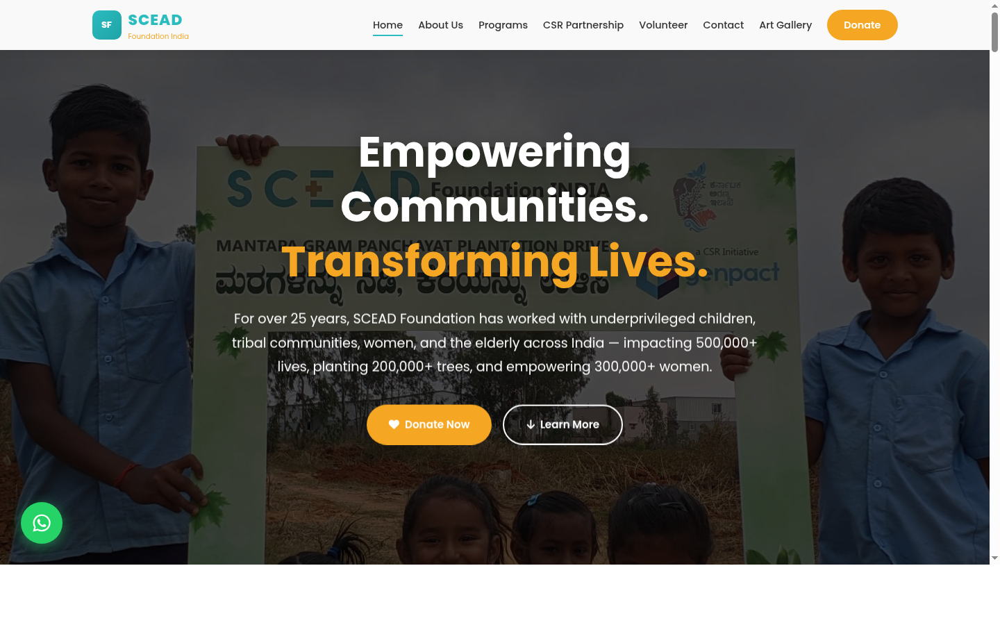
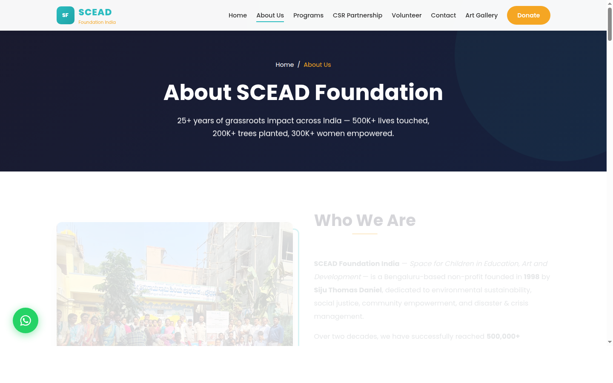
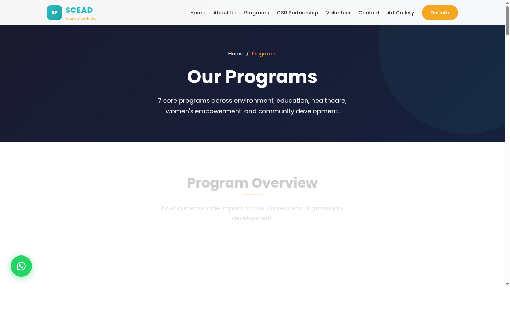
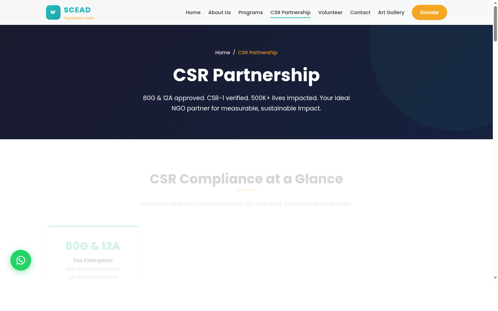
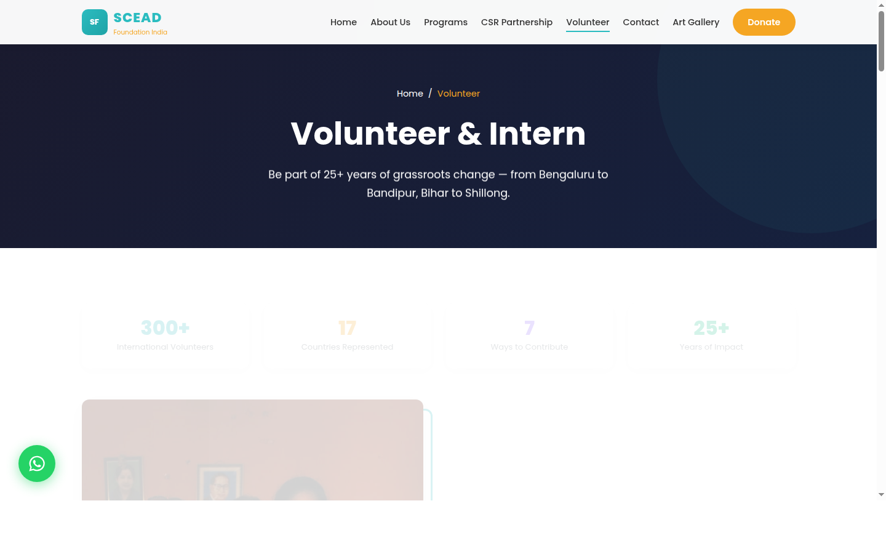
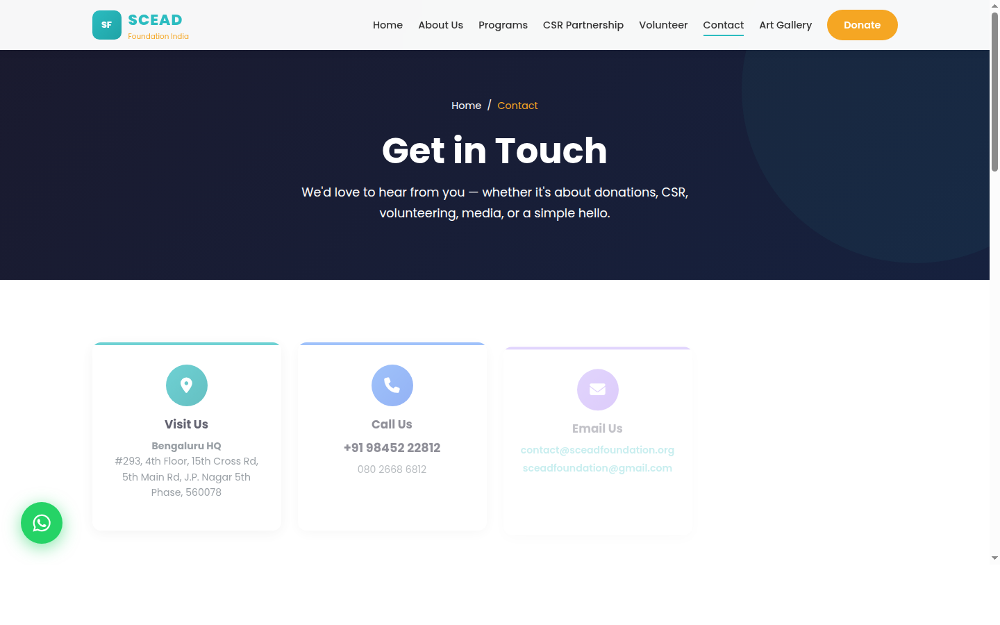
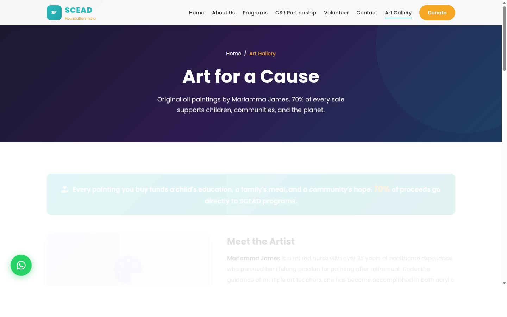
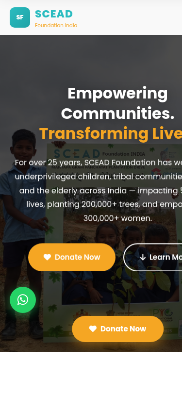
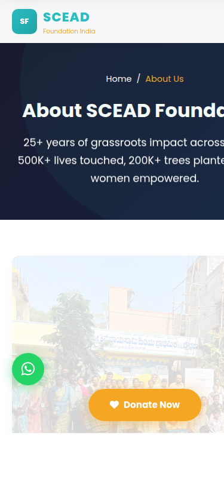

<div align="center">

# SCEAD Foundation India

### Space for Children in Education, Art and Development

[](https://www.sceadfoundation.org/)
[](https://wa.me/919845222812?text=Hello%20SCEAD%20Foundation!%20I%20visited%20your%20website%20and%20would%20love%20to%20know%20more%20about%20your%20work.)
[](#-donate)

<br />



**Empowering Communities. Transforming Lives.**

*A Bengaluru-based non-profit dedicated to environmental sustainability, education, tribal welfare, women's empowerment, and community development since 1998.*

---

</div>

## About SCEAD Foundation

**SCEAD Foundation India** (Reg. No: GAN-04-00209) is a registered NGO founded in **1998** by **Siju Thomas Daniel**. For over two decades, we have driven sustainable initiatives spanning climate action, education, health, and rural development across India — impacting **500,000+ lives** in marginalized communities.

Our work is endorsed by the **Governor of Karnataka**, the **US Secretary of State**, former **UN Environment Executive Director Mr. Erik Solheim**, and diplomatic missions from **Italy, Japan, Germany, Canada, UK, Australia, and France**.

> *"We believe that true development starts at the grassroots — when you empower a child with education, a woman with livelihood, and a community with dignity, you change the world one village at a time."*
>
> — **Siju Thomas Daniel**, Managing Trustee & Founder

---

## Impact at a Glance

<div align="center">

| Metric | Impact |
|:---|:---|
| Lives Impacted | **500,000+** |
| Trees Planted & Lakes Restored | **200,000+** |
| Women Empowered | **300,000+** |
| Vulnerable Youth Aided | **50,000+** |
| Sanitation Units Built | **500+** |
| Government Schools Adopted | **35** |
| Tribal Beneficiaries | **15,000+** |
| International Volunteers | **300+ from 17 countries** |
| CSR Partners | **10+** |
| Years of Grassroots Work | **25+** |

</div>

---

## Website Pages

### Homepage
Full landing page with hero, trust badges, impact stats, focus areas, 39-post chronological archive (2019-2025), diplomatic recognition, CTA cards, partner scroll, and Snehalaya HIV Home section.


### About Us
Team & advisory board (IRS, IPS officers), 9-milestone timeline, founder section, values, 3-city presence, and global volunteer network with 17 country flags.



### Programs
7 program areas — environment, education, HIV home, girl child, community development, elderly care, disaster relief — with stat pills, split-grid layouts, gallery overlays, and event cards.



### CSR Partnership
Compliance cards (80G, 12A, CSR-1), Schedule VII coverage, 4-step process timeline, 18 partner cards, and enquiry form with WhatsApp.



### Volunteer & Intern
Stat pills, 7 opportunity cards, internship features, real testimonials from Bahrain volunteers, 16-country coordinator network with flags, yoga program, and registration form.



### Contact
Gradient icon cards, contact form with Google Maps, 3-branch office details, branded social buttons, and office hours.



### Art Gallery
Fundraising through original oil paintings by Mariamma James. Artist portrait, painting specs, cause breakdown, 4-step purchase process.



### Mobile Responsive

<div align="center">

&nbsp;&nbsp;&nbsp;

</div>

---

## Core Focus Areas

### 1. Climate Action & Environment
- 200K+ trees planted across Bengaluru, Anekal, Jigani, Bannerghatta, Shillong, Metur Dam
- Lake rejuvenation, CERA-verified carbon sequestration
- Governor of Karnataka Million Trees Project, Genpact "Sowing Seeds of Sustainability" (7,000 saplings)
- Diplomatic tree planting with consulates of Japan, Italy, Germany, Canada, UK, Australia

### 2. Education & Child Welfare
- 35 government schools adopted (Cleveland Town since 2011, Badrahalli Tamil Nadu 2024)
- 50,000+ vulnerable youth aided
- Anti-child labour, street children rescue, summer schools
- Snehalaya HIV Children's Home (20+ years), Girl Child Orphanage, Save Girl Child Campaign

### 3. Community Development & Women Empowerment
- 300,000+ women empowered through skill development and livelihood training
- 15,000+ tribal beneficiaries via livestock distribution (cows, calves, sheep, goats)
- 500+ sanitation units built, Saukhyam reusable pad training
- Elderly care across tribal, rural, and urban communities

### 4. Disaster Relief
- Turkey earthquake relief (2023) — with Genpact, AHIMSA India, Turkish Consulate
- COVID-19 relief (2020) — 12,000 kg food, US Secretary of State Pompeo tweet

---

## CSR Compliance

| Document | Status |
|:---|:---|
| 80G Registration | AAITS0428E25BL02 |
| 12A Registration | AAITS0428E25BL01 / AAITS0428E |
| CSR-1 Registration | Verified |
| Certified Audit Reports | 3 years, 100% clean |
| Income Tax Returns | 10+ years continuous filing |
| Government Registration | GAN-04-00209 |

---

## Tech Stack

| Component | Technology |
|:---|:---|
| **Markup** | Semantic HTML5 |
| **Styling** | CSS3 with CSS Variables, page-specific style blocks |
| **Interactivity** | Vanilla JavaScript (zero frameworks) |
| **Typography** | Google Fonts — Poppins |
| **Icons** | Font Awesome 6 |
| **Animations** | Custom IntersectionObserver-based scroll animations |
| **Build** | None — pure static files, no bundler needed |

### Performance
- Lazy-loaded images with IntersectionObserver
- Lightweight (~30KB CSS + ~8KB JS)
- Custom scroll animations (no AOS library dependency)
- Mobile-first responsive (375px to 1440px+)
- Load-more pagination on homepage archive

---

## Project Structure

```
sceadfoundation/
├── index.html              # Homepage — hero, stats, 39-post archive, recognition
├── about.html              # About — timeline, team, values, global network
├── programs.html           # Programs — 7 focus areas with galleries
├── csr.html                # CSR — compliance, process, partners, form
├── volunteer.html          # Volunteer — opportunities, testimonials, form
├── contact.html            # Contact — form, map, branches
├── art-gallery.html        # Art Gallery — paintings fundraiser
├── styles.css              # Global design system
├── scripts.js              # Animations, counters, navigation, load-more
├── images/                 # 11 real SCEAD Foundation photographs
├── screenshots/            # Website screenshots for README
└── README.md               # This file
```

---

## Run Locally

```bash
git clone https://github.com/vmishra/sceadfoundation.git
cd sceadfoundation
python3 -m http.server 8888
# Open http://localhost:8888
```

No build step. No dependencies. No configuration.

---

## Our Partners

<div align="center">

**Genpact** · **Ascend Telecom** · **Anthem Biosciences** · **Zentree Labs** · **Tower Vision India**

**St. Joseph's Institutions** · **Christ University** · **AIESEC** · **IPYG** · **HWPL**

**Rotary Club Bangalore** · **Jindal Global Law School** · **Candor International School** · **HCG Cancer Centre**

</div>

---

## Recognition & Endorsements

| Who | What |
|:---|:---|
| **US Secretary of State Mike Pompeo** | Tweeted about SCEAD's COVID-19 relief (2020) |
| **Mr. Erik Solheim** | Former UN Environment Executive Director visited SCEAD |
| **Governor of Karnataka** | Flagged off Million Trees Project at Raj Bhavan (2022) |
| **Sri Harsha Vardhan, IRS** | Commissioner Customs & GST — SCEAD Senior Adviser |
| **Ms Nisha James, IPS** | Adviser on Women and Child |
| **Consulate of Italy** | Mr. Alfonso Tagliaferri — tree planting & Hiroshima Day |
| **Consulate of Japan** | Mr. Katsumasa Mauro — peace tree planting, Million Trees resolution |
| **Consulate of Germany** | Mr. Achim Burkart — environment conference |
| **British High Commission** | James Godber, Deputy Head of Mission — Hiroshima Day |
| **Australian High Commission** | Ms. Caitlin Searle — plantation drive |
| **Consulate of Canada** | Mr. Daniel Morency — Indo-Canadian student exchange |
| **French Consulate** | Sapling handover ceremony |

---

## Contact

| | |
|:---|:---|
| **Bengaluru HQ** | #293, 4th Floor, 15th Cross Road, 5th Main Rd, J.P. Nagar, Bengaluru 560078 |
| **Mumbai Office** | Social Nagar, M.G. Road, Sion — Dharavi, Mumbai 400022 |
| **Chandigarh** | Prof. Mohit Verma · contactchandigarh@sceadfoundation.org |
| **Phone** | +91 9845222812 |
| **Email** | contact@sceadfoundation.org |
| **WhatsApp** | [Chat Now](https://wa.me/919845222812) |

---

<div align="center">

[](https://www.sceadfoundation.org/)
[](https://wa.me/919845222812?text=Hello%20SCEAD%20Foundation!%20I%20would%20like%20to%20make%20a%20donation.)
[](https://wa.me/919845222812?text=Hello%20SCEAD!%20I%20want%20to%20volunteer.)

**SCEAD Foundation India** · Est. 1998 · Reg: GAN-04-00209 · 80G & 12A Approved · CSR-1 Verified

*Empowering communities. Transforming lives.*

&copy; 2026 SCEAD Foundation India. All Rights Reserved.

</div>
